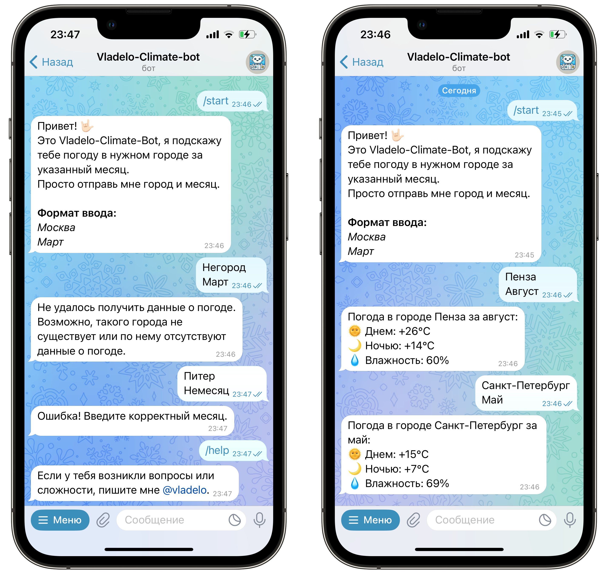

# 🌤 Vladelo-Climate-Bot — Telegram-бот для получения статистики погоды

Этот бот позволяет узнать среднюю дневную и ночную температуру, а также влажность в указанном месяце и городе.

---

## 🚀 **Принцип работы**

1. Пользователь отправляет боту название города и месяц на русском языке (каждый с новой строки).
2. Бот переводит город в транслит, а месяц — в его порядковый номер.
3. Парсер получает данные о средней температуре и влажности за выбранный месяц.
4. Бот отправляет пользователю ответ с температурой днем, ночью и уровнем влажности.

**Пример запроса:**

```
Москва
Январь
```

**Пример ответа:**

```
Погода в городе Москва за январь:  
🌞 Днем: -5°C  
🌙 Ночью: -12°C  
💧 Влажность: 75%  
```



---

## ⚙️ **Установка и запуск**

---

### 🔹 **Вариант 1: Локальный запуск**

#### 1. Клонировать репозиторий

```bash
git clone https://github.com/vladelo777/Vladelo-Climate-Bot.git
cd Vladelo-Climate-Bot
```

#### 2. Установить зависимости

```bash
pip install -r requirements.txt
```

#### 3. Добавить токен бота

Создай файл `.env` в корне проекта и добавь в него:

```
BOT_TOKEN=твой_токен
```

#### 4. Запустить бота

```bash
python app/main.py
```

---

### 🐳 **Вариант 2: Запуск через Docker**

#### 1. Клонировать репозиторий

```bash
git clone https://github.com/vladelo777/Vladelo-Climate-Bot.git
cd Vladelo-Climate-Bot
```

#### 2. Создать `.env` на основе шаблона

```bash
cp .env.template .env
```

Укажи токен внутри `.env`:

```
BOT_TOKEN=твой_токен
```

#### 3. Построить и запустить контейнер

```bash
docker build -t climate-bot .
docker run --rm --env-file .env climate-bot
```

---

## 📂 **Структура проекта**

```
/Vladelo-Climate-Bot
│── app/
│   ├── tg_bot.py         # Код Telegram-бота
│   ├── parser.py         # Парсер погоды
│   ├── utils.py          # Вспомогательные функции: транслитерация города, перевод месяца
│   ├── main.py           # Точка входа в приложение
│   ├── config.py         # Загрузка настроек (токен для бота)
│
│── photos/
│   └── photo.jpg         # Изображение для Readme
│
│── .env                  # Переменные окружения
│── .env.template         # Шаблон для .env
│── requirements.txt      # Зависимости (aiogram, dotenv и т.д.)
│── Dockerfile            # Инструкция для сборки Docker-образа
│── .dockerignore         # Исключения при сборке образа
│── .gitignore            # Исключения для Git (например: .env, __pycache__, venv)
```

---

## 🎯 **Технологии**

- **Python** 🐍
- **Aiogram** 🤖 (асинхронный Telegram-фреймворк)
- **BeautifulSoup** 🌐 (парсинг данных о погоде)
- **Requests** 🔗 (отправка HTTP-запросов)
- **Re (Regular Expressions)** 🔍 (обработка и фильтрация данных)
- **python-dotenv** 🔐 (загрузка конфиденциальных данных из `.env`)
- **Docker** 🐳 (контейнеризация и простота развертывания)

---

## 🛠 **Дополнительно**

- Чтобы скрыть `BOT_TOKEN`, **не загружай `.env` в Git** (он уже в `.gitignore`).
- Бот поддерживает Markdown-разметку для красивого форматирования сообщений.

---

## 📬 **Контакты**

Автор: Владислав Лахтионов  
GitHub: [vladelo-code](https://github.com/vladelo-code)  
GitHub: [vladelo](https://gitverse.ru/vladelo/)  
Telegram: [@vladelo](https://t.me/vladelo)

💌 Не забудьте поставить звезду ⭐ на GitHub, если вам понравился бот! 😉
